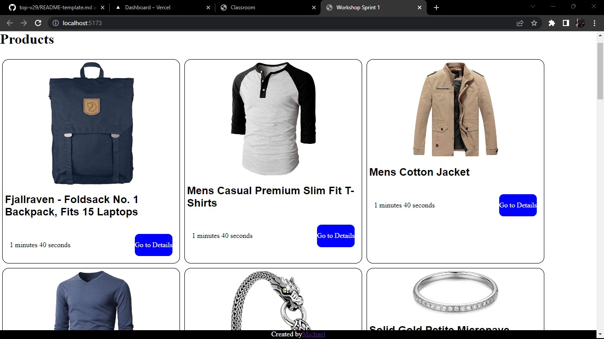

# Make It Real - Workshop Sprint 1

This is a solution to the Workshop Sprint 1 of the Make It Real course.

## Table of contents

- [Make It Real - Workshop Sprint 1](#make-it-real---workshop-sprint-1)
  - [Table of contents](#table-of-contents)
  - [Overview](#overview)
    - [The challenge](#the-challenge)
    - [Screenshot](#screenshot)
  - [My process](#my-process)
    - [Built with](#built-with)
    - [What I learned](#what-i-learned)
    - [Continued development](#continued-development)
    - [Useful resources](#useful-resources)
  - [Author](#author)
  - [Acknowledgments](#acknowledgments)

## Overview

### The challenge

Users should be able to:

- see the home page with somo products,the about page with some information about the developer
- see the information of each product while the timer is still runinig

### Screenshot

## My process

### Built with

- Semantic HTML5 markup
- SASS
- react-router-dom

### What I learned

With this project i practiced all the concepts we learned during the bootcamp,html,css,javascript,react,react-router.

### Continued development

theres a lo t to learn and investigate about react and other libraries like react-router. im planing to keep learning this tools in depht

### Useful resources

- [react router docs](https://reactrouter.com/en/main) - 

## Author

- Website - [Michael](https://github.com/Mike2020x)

## Acknowledgments

Thanks to our mentors and all my partners.